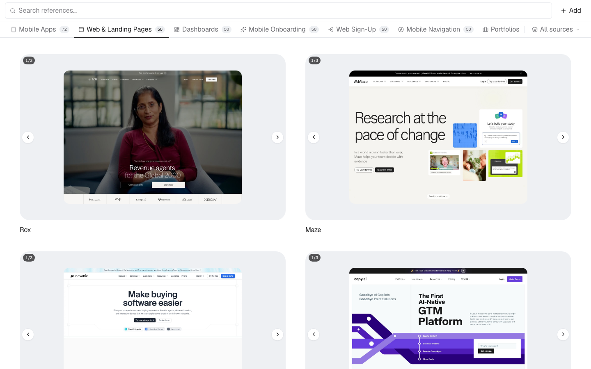

# Design reference library

Personal visual archive. Paste links or upload screenshots, then browse them in a gallery.



```bash
npm install
npm run dev
```

Data stays in this browser (IndexedDB). No account required.

## References

A reference can contain one complete image or several meaningful screens. Cards
and the detail modal share one carousel component for multi-image references:
swipe on touch, use arrows or arrow keys on a pointer, or select a pagination
dot. Single-image references keep the same stable frame without carousel controls.

A reference can belong to several collections at once (`collectionIds`), because
a sign-up flow that starts on a marketing page honestly belongs under Web,
Onboarding and Landing Pages.

## Seeded examples

The examples are generated, not hand written. `src/lib/storage/seed-examples.ts`
is produced by:

```bash
python3 scripts/harvest-mobbin.py     # metadata + flow screens -> scripts/mobbin-data.json
python3 scripts/build-seed-data.py    # screens -> public/screens, seeds -> seed-examples.ts
python3 scripts/make-audit-sheets.py  # contact sheet per reference, for reviewing categories
```

Collections are assigned by looking at the actual interface. Single-image
references remain visible; genuine Mobbin flows receive their available screens,
and long pages receive top, middle, and lower 1440 × 1080 viewport captures.

Seeding is keyed to `SEED_REVISION`: when the seed data changes, seeded rows are
replaced and references you added yourself (no `seedKey`) are left alone.

## QA

Both scripts drive the running dev server with a real browser:

```bash
npm run dev
npm run qa:responsive   # 320/375/390/430/768/1280/1600, overflow, carousels, modal
npm run qa:tabs         # chip counts vs rendered cards, categories, search, filters
```
